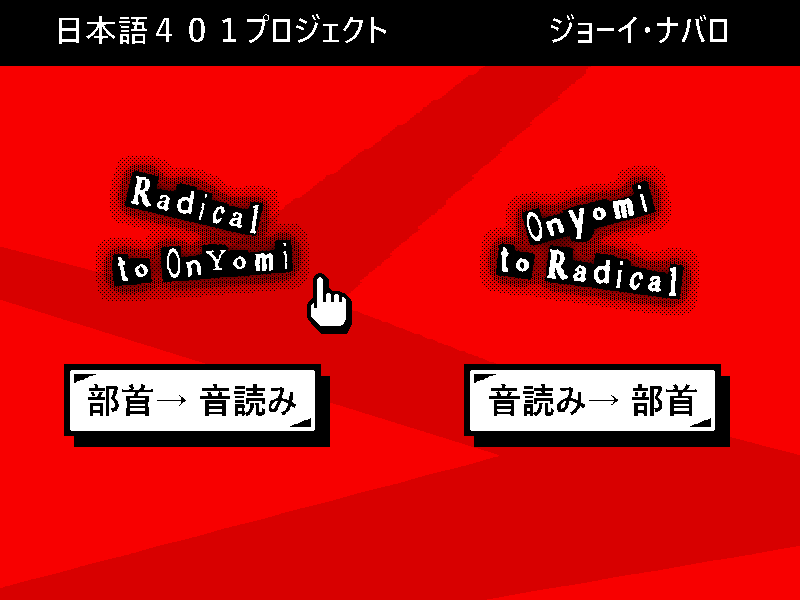
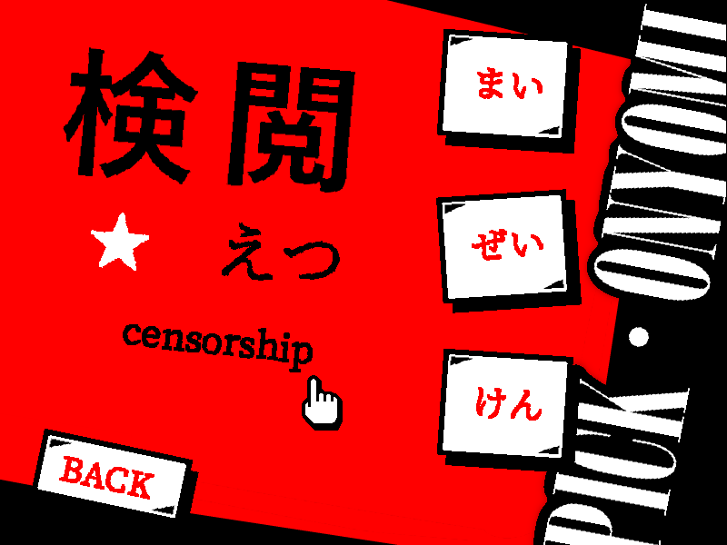
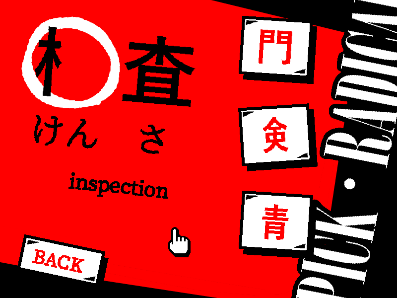
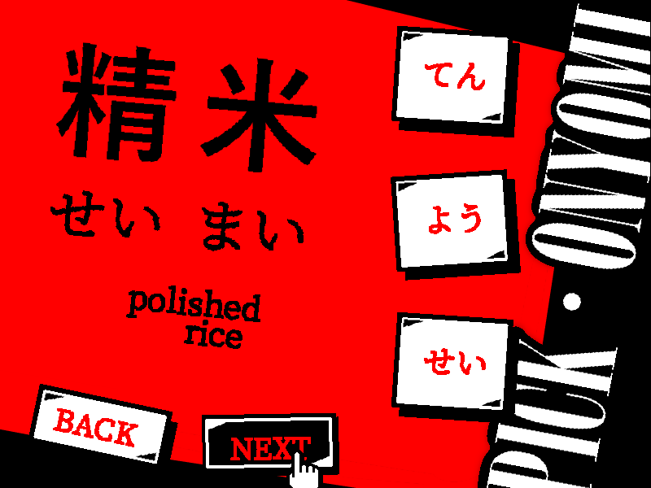

# Kanji by Radical
## Overview
Educational game developed as a final project for Japanese VII at Purdue University. Teaches users to sight-read certain kanji by matching common pronunciations with their associated radicals.

   

## Dependencies
* **[Pygame](https://www.pygame.org/news)** 1.9.3+
* **[Python](https://www.python.org/)** 3.4+
